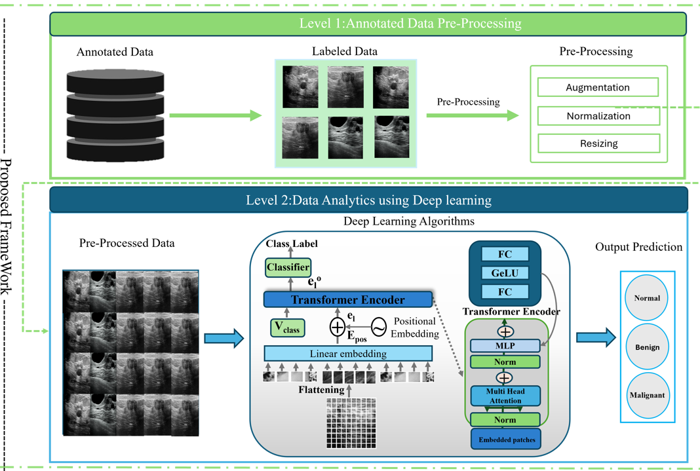

# Breast Ultrasound Tumor Classification: Comparative Analysis of CNN and Vision Transformer Models

This repository contains the implementation and results of a research study focused on diagnosing and classifying breast tumors from ultrasound images using deep learning models. The study compares the performance of various Convolutional Neural Network (CNN) architectures and Vision Transformer (ViT) models.

## Framework Overview
The following diagram illustrates the workflow of the proposed framework:



## Highlights
- **Objective**: Enhance diagnostic accuracy by comparing CNN and ViT models on breast ultrasound images.
- **Dataset**: Breast ultrasound images annotated for classification into malignant, benign, or normal categories.
- **Deep Learning Models Trained**:
  - **CNN Architectures**: VGG16, InceptionV3, Xception, ResNet101V2, InceptionResNetV2 (update based on your implementation).
  - **Vision Transformer (ViT)**: Explores the application of transformer-based architectures for medical imaging.
- **Comparative Analysis**:
  - Evaluation using performance metrics like accuracy, sensitivity, specificity, and AUC.
  - Analysis of strengths and weaknesses of each model in detecting and classifying malignancy.
- **Significance**:
  - Demonstrates the effectiveness of deep learning in medical imaging tasks.
  - Highlights the emerging role of transformer models in medical diagnosis.

## Repository Contents
- **Dataset**: Preprocessed dataset used for training and testing (if applicable) or a link/instructions to access the dataset.
- **Code**:
  - Training scripts for CNN and ViT models.
  - Data preprocessing and augmentation techniques.
  - Visualization scripts for results and performance comparison.
- **Results**: Comparative analysis charts and evaluation metrics.

## How to Use
1. Clone the repository:
   ```bash
   git clone https://github.com/muhammadsaadkhankor/BreastUS.git
   cd BreastUS
   ```

2. Install dependencies (update as needed):
   ```bash
   pip install -r requirements.txt
   ```

3. Prepare the dataset:
   - Place your dataset in the expected directory structure (update this section to match your repo).
   - Ensure labels/classes are correctly mapped to `malignant`, `benign`, and `normal`.

4. Train the models:
   - Run the provided training scripts for CNN and ViT (update command examples based on your scripts).
   ```bash
   python train_cnn.py
   python train_vit.py
   ```

5. Evaluate / test:
   ```bash
   python evaluate.py
   ```

## Citation
If you use this repository in your research, please cite:

```bibtex
@inproceedings{saad2022breastus,
  author    = {Muhammad Saad and Mohib Ullah and Hina Afridi and Faouzi Alaya Cheikh and Muhammad Sajjad},
  title     = {BreastUS: Vision Transformer for Breast Cancer Classification Using Breast Ultrasound Images},
  booktitle = {2022 16th International Conference on Signal-Image Technology \& Internet-Based Systems (SITIS)},
  pages     = {246--253},
  year      = {2022},
  publisher = {IEEE},
  doi       = {10.1109/SITIS57111.2022.00027},
  url       = {https://doi.org/10.1109/SITIS57111.2022.00027}
}
```

## License
Add your license here (e.g., MIT, Apache-2.0) or include a `LICENSE` file.

## Contact
For questions or collaboration, open an issue on this repository.
